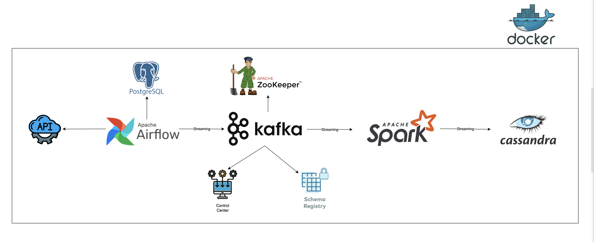

# realtime_data_streaming_pipeline

### INTRODUCTION
This project involves building a streaming data pipeline. The data is sourced from the [random_address](https://random-data-api.com/api/v2/addresses) API. The project covers each stage of the pipeline, from data ingestion to data processing and finally to data storage. Everything is containerized using Docker for ease of deployment and scalability.

### SYSTEM ARCHITECTURE

#### The streaming data pipeline in this project consists of the following key components:
- `Data Source`: The project utilizes the [random_address](https://random-data-api.com/api/v2/addresses) API to generate random address data, which serves as the primary data source for the pipeline.
- `Apache Airflow`: This tool is responsible for orchestrating the entire data pipeline, fetching data from the API, and storing it in a `PostgreSQL` database.
- `Apache Kafka` and `Zookeeper`: These components are used to stream data from the PostgreSQL database to the processing engine, providing a reliable and scalable data ingestion mechanism.
- `Control Center` and `Schema Registry`: These tools assist in monitoring the Kafka streams and managing the data schemas, ensuring the integrity and consistency of the streaming data.
- `Apache Spark`: The Spark engine is utilized for data processing, with its master and worker nodes handling the distributed computation and transformation of the data.
- `Cassandra`: The processed data is ultimately stored in the Cassandra database, providing a scalable and durable data storage solution.

### TECHNOLOGIES
- Docker
- Python
- Apache Airflow
- PostgreSQL
- Apache Kafka
- Apache Zookeeper
- Apache Spark
- Cassandra

